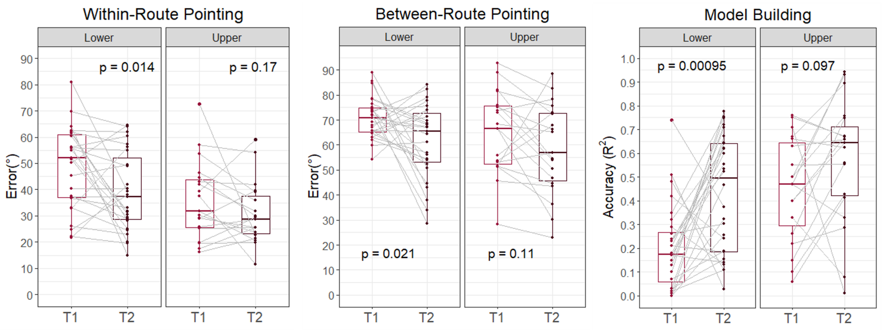
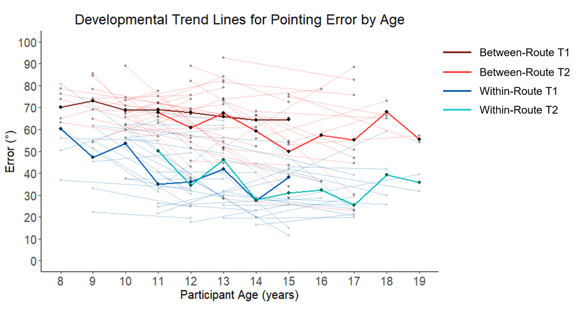

# LongitudinalSilcton

**This Jupyter Notebook contains the data analysis pipeline for:** 
Brucato, M., Nazareth, A., & Newcombe, N. S., (2022) Longitudinal development of cognitive mapping from childhood to adolescence. *Journal of Experimental Child Psychology*.[1](https://doi.org/10.1016/j.jecp.2022.105412) 
 
**Coding languages:** Python, R.
 
 
**Outline of the Noteboook:**
1. Import raw data from each task
2. Quality check, code, and format data from each task
3. Merge data together in one dataframe by participant ID
4. Calculate descriptive statistics & run outlier detection
5. Generate manuscript tables
6. Generate manuscript figures
 

## Manuscript figures generated from this code:

Scatterplots of navigation performance for upper and lower age groups in our sample.  

Developmental trend lines of pointing performance by age.  

